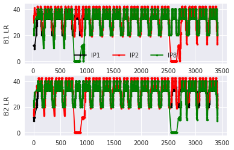
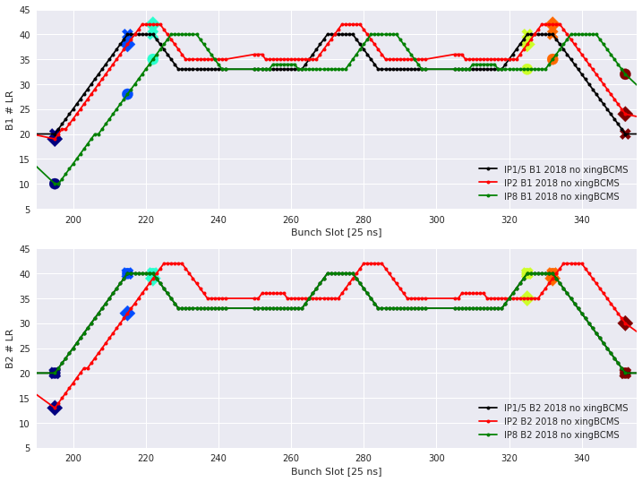

# Für Axel: Getting Machine Data for DA


```python
# some HTML magic
from IPython.core.display import display, HTML
display(HTML("<style>.container { width:100% !important; }</style>"))
```


<style>.container { width:100% !important; }</style>


```python
# Load ALL the Stuff!
import pandas as pd
import numpy as np
import pickle
import gzip
import datetime
import seaborn as sns
import cl2pd
from cl2pd import importData
from cl2pd import plotFunctions
from cl2pd import dotdict
from cl2pd import bbFunctions
from cl2pd import variablesDF
cals=importData.cals
import matplotlib.pyplot as plt
%matplotlib inline
import itertools
from operator import itemgetter
import warnings
warnings.filterwarnings("ignore") #i.e. "oh shut up"
from cl2pd import importLSA
```

    WARNING:cmmnbuild_dep_manager:JVM is already started


## Data Collection

For my study, I need to follow the evolution of some bunches within an operational fill.

The frequency is not of a huge importance, I select a point every 10min. 

The settings that we can control in the simulation are:
- bunch intensity
- bunch emittance (assuming $\varepsilon_n^H == \varepsilon_n^V$ )
- bunch length
- xing angle
- betastar
- octupole current
- tune
- chromaticity
- no of LR per IP

I use the luminosity follow-up data to speed up the data collection, complemented by CALS, and LSA for chroma/tune trims (*very dependent on the initial setting!*). The bbEncounter schedule is also used.


```python
#Define the nLR to consider (taken by default MAD-X setup)
nLR = [21, 20, 20]
```


```python
filln = 7270
```


```python
def getFillingScheme(filln):
    '''Given a fill number return:
    filled_slots_b1, filled_slots_b2, slots_coll_b1, slots_coll_b2, slots_noncoll_b1, slots_noncoll_b2, b1_fill_pattern, b2_fill_pattern
    '''
    
    bmodes = importData.LHCFillsByNumber(filln)
    FILL_PATTERN_DF = pd.DataFrame()
    FILL_PATTERN_DF = importData.cals2pd(['LHC.BCTFR.A6R4.B1:BUNCH_FILL_PATTERN','LHC.BCTFR.A6R4.B2:BUNCH_FILL_PATTERN'], pd.Timestamp(bmodes['startTime'][bmodes['mode']=='PRERAMP'].values[0]), pd.Timestamp(bmodes['startTime'][bmodes['mode']=='PRERAMP'].values[0]+pd.Timedelta(seconds=1)) )
    b1_fill_pattern = np.array(FILL_PATTERN_DF.filter(regex="LHC.*B1.*").iloc[0].values[0]);
    b2_fill_pattern = np.array(FILL_PATTERN_DF.filter(regex="LHC.*B2.*").iloc[0].values[0]);

    # define the filled slots and the colliding / non-colliding
    filled_slots_b1 = np.where(b1_fill_pattern == 1)[0]
    filled_slots_b2 = np.where(b2_fill_pattern == 1)[0]
    slots_noncoll_b1 = np.array([x for x in filled_slots_b1 if x not in filled_slots_b2])
    slots_noncoll_b2 = np.array([x for x in filled_slots_b2 if x not in filled_slots_b1])
    slots_coll_b1 = np.array([x for x in filled_slots_b1 if x in filled_slots_b2])
    slots_coll_b2 = np.array([x for x in filled_slots_b2 if x in filled_slots_b1])

    print('---------- FILL {} ----------'.format(filln))
    print('B1 slots               : {}'.format(len(filled_slots_b1)))
    print('B2 slots               : {}'.format(len(filled_slots_b2)))
    print('B1 IP1/5 colliding slots     : {}'.format(len(slots_coll_b1)))
    print('B2 IP1/5 colliding slots     : {}'.format(len(slots_coll_b2)))
    print('B1 IP1/5 non-colliding slots : {}'.format(len(slots_noncoll_b1)))
    print('B2 IP1/5 non-colliding slots : {}'.format(len(slots_noncoll_b2)))
    return filled_slots_b1, filled_slots_b2, slots_coll_b1, slots_coll_b2, slots_noncoll_b1, slots_noncoll_b2, b1_fill_pattern, b2_fill_pattern
```


```python
# Get the B1/B2 encounter schedule (and store to some arrays... don't ask why)
filled_slots_b1, filled_slots_b2, slots_coll_b1, slots_coll_b2, slots_noncoll_b1, slots_noncoll_b2, b1_fill_pattern, b2_fill_pattern = getFillingScheme(filln)
BBMATRIX = bbFunctions.computeBBMatrix(nLR)
b1_collisionScheduleDF = bbFunctions.B1CollisionScheduleDF(b1_fill_pattern, b2_fill_pattern, nLR)
b2_collisionScheduleDF = bbFunctions.B2CollisionScheduleDF(b1_fill_pattern, b2_fill_pattern, nLR)
# Collides in IP2
# -- B1
b1_collisionScheduleDF['collidesIP2'] = b1_collisionScheduleDF["HO partner in ALICE"].fillna(-1)
b1_collisionScheduleDF['collidesIP2'][b1_collisionScheduleDF['collidesIP2']>=0] = 2
# -- B2
b2_collisionScheduleDF['collidesIP2'] = b2_collisionScheduleDF["HO partner in ALICE"].fillna(-1)
b2_collisionScheduleDF['collidesIP2'][b2_collisionScheduleDF['collidesIP2']>=0] = 2
# Collides in IP8
# -- B1
b1_collisionScheduleDF['collidesIP8'] = b1_collisionScheduleDF["HO partner in LHCB"].fillna(-1)
b1_collisionScheduleDF['collidesIP8'][b1_collisionScheduleDF['collidesIP8']>=0] = 3
# -- B2
b2_collisionScheduleDF['collidesIP8'] = b2_collisionScheduleDF["HO partner in LHCB"].fillna(-1)
b2_collisionScheduleDF['collidesIP8'][b2_collisionScheduleDF['collidesIP8']>=0] = 3
# Collides in IP1/5
# -- B1
b1_collisionScheduleDF['collidesIP1'] = b1_collisionScheduleDF["HO partner in ATLAS/CMS"].fillna(-1)
b1_collisionScheduleDF['collidesIP1'][b1_collisionScheduleDF['collidesIP1']>=0] = 1
# -- B2
b2_collisionScheduleDF['collidesIP1'] = b2_collisionScheduleDF["HO partner in ATLAS/CMS"].fillna(-1)
b2_collisionScheduleDF['collidesIP1'][b2_collisionScheduleDF['collidesIP1']>=0] = 1
####--------------
b1_slots_coll = b1_collisionScheduleDF.index.values
b2_slots_coll = b2_collisionScheduleDF.index.values
b1_coll_IP8   = b1_collisionScheduleDF['# of LR in LHCB'].values
b2_coll_IP8   = b2_collisionScheduleDF['# of LR in LHCB'].values
b1_coll_IP2   = b1_collisionScheduleDF['# of LR in ALICE'].values
b2_coll_IP2   = b2_collisionScheduleDF['# of LR in ALICE'].values
b1_coll_IP1   = b1_collisionScheduleDF['# of LR in ATLAS/CMS'].values
b2_coll_IP1   = b2_collisionScheduleDF['# of LR in ATLAS/CMS'].values
```

    ---------- FILL 7270 ----------
    B1 slots               : 2556
    B2 slots               : 2556
    B1 IP1/5 colliding slots     : 2544
    B2 IP1/5 colliding slots     : 2544
    B1 IP1/5 non-colliding slots : 12
    B2 IP1/5 non-colliding slots : 12


```python
# let's have a look
f = plt.figure()
ax1 = plt.subplot(211)
ax1.plot(b1_slots_coll, b1_coll_IP1, 'k.-' , label="IP1")
ax1.plot(b1_slots_coll, b1_coll_IP2, 'r.-' , label="IP2")
ax1.plot(b1_slots_coll, b1_coll_IP8, 'g.-' , label="IP8")
ax1.legend(loc='lower center', ncol=3)
ax1.set_ylabel("B1 LR")

ax2 = plt.subplot(212)
ax2.plot(b2_slots_coll, b2_coll_IP1, 'k.-' , label="IP1")
ax2.plot(b2_slots_coll, b2_coll_IP2, 'r.-' , label="IP2")
ax2.plot(b2_slots_coll, b2_coll_IP8, 'g.-' , label="IP8")
ax2.set_ylabel("B2 LR")
```


    Text(0,0.5,u'B2 LR')


```python
# Split the filling scheme into choo-choo's
def getBeamTrains(filln):
    '''Given a fill number, aquire the filling pattern and return a list of lists for b1_trains, b2_trains'''
    filled_slots_b1, filled_slots_b2, slots_coll_b1, slots_coll_b2, slots_noncoll_b1, slots_noncoll_b2, b1_fill_pattern, b2_fill_pattern = getFillingScheme(filln)
    b1_trains, b2_trains = [], []
    for k,g in itertools.groupby(enumerate(filled_slots_b1),lambda x:x[0]-x[1]):
        group = (map(itemgetter(1),g))
        group = list(map(int,group))
        b1_trains.append(group)
    for k,g in itertools.groupby(enumerate(filled_slots_b2),lambda x:x[0]-x[1]):
        group = (map(itemgetter(1),g))
        group = list(map(int,group))
        b2_trains.append(group)#ranges.append((group[0],group[-1]))
        
    return b1_trains, b2_trains
```


```python
b1_trains, b2_trains = getBeamTrains(filln)
```

    ---------- FILL 7270 ----------
    B1 slots               : 2556
    B2 slots               : 2556
    B1 IP1/5 colliding slots     : 2544
    B2 IP1/5 colliding slots     : 2544
    B1 IP1/5 non-colliding slots : 12
    B2 IP1/5 non-colliding slots : 12


```python
# Give some "train index" to flatten the data (because I'm not that smart)
b1_indx_train = []
b2_indx_train = []
for indx, tr in enumerate(b1_trains):
    tmp_list = np.ones_like(tr)*indx
    b1_indx_train.append(tmp_list.tolist())
for indx, tr in enumerate(b2_trains):
    tmp_list = np.ones_like(tr)*indx
    b2_indx_train.append(tmp_list.tolist())
```


```python
# Good, now get the LR for each bunch in each train:
b1_nlR_1 = []
b1_nlR_2 = []
b1_nlR_8 = []

b2_nlR_1 = []
b2_nlR_2 = []
b2_nlR_8 = []

for i_train in b1_trains:
    b1_nlR_1.append(b1_coll_IP1[np.isin(b1_slots_coll , np.array(i_train))].tolist())
    b1_nlR_2.append(b1_coll_IP2[np.isin(b1_slots_coll , np.array(i_train))].tolist())
    b1_nlR_8.append(b1_coll_IP8[np.isin(b1_slots_coll , np.array(i_train))].tolist())

for i_train in b2_trains:
    b2_nlR_1.append(b2_coll_IP1[np.isin(b2_slots_coll , np.array(i_train))].tolist())
    b2_nlR_2.append(b2_coll_IP2[np.isin(b2_slots_coll , np.array(i_train))].tolist())
    b2_nlR_8.append(b2_coll_IP8[np.isin(b2_slots_coll , np.array(i_train))].tolist())
```


```python
# Flatten everything
b1_trains     = [item for sublist in b1_trains for item in sublist]
b2_trains     = [item for sublist in b2_trains for item in sublist]
b1_indx_train = [item for sublist in b1_indx_train for item in sublist]
b2_indx_train = [item for sublist in b2_indx_train for item in sublist]
b1_nlR_1      = [item for sublist in b1_nlR_1 for item in sublist]
b1_nlR_2      = [item for sublist in b1_nlR_2 for item in sublist]
b1_nlR_8      = [item for sublist in b1_nlR_8 for item in sublist]
b2_nlR_1      = [item for sublist in b2_nlR_1 for item in sublist]
b2_nlR_2      = [item for sublist in b2_nlR_2 for item in sublist]
b2_nlR_8      = [item for sublist in b2_nlR_8 for item in sublist]
```


```python
# Make a DF because... Guido :)
selectDF_B1 = pd.DataFrame()
selectDF_B1['Bunch']  = b1_trains
selectDF_B1['Train']  = b1_indx_train
selectDF_B1['IP1_LR'] = b1_nlR_1
selectDF_B1['IP2_LR'] = b1_nlR_2
selectDF_B1['IP8_LR'] = b1_nlR_8

selectDF_B2 = pd.DataFrame()
selectDF_B2['Bunch']  = b2_trains
selectDF_B2['Train']  = b2_indx_train
selectDF_B2['IP1_LR'] = b2_nlR_1
selectDF_B2['IP2_LR'] = b2_nlR_2
selectDF_B2['IP8_LR'] = b2_nlR_8
```


```python
# Redo the plot above to check validity of transformations
# let's have a look
f = plt.figure()
ax1 = plt.subplot(211)
ax1.plot(selectDF_B1['Bunch'].values, selectDF_B1['IP1_LR'].values, 'k.-' , label="IP1")
ax1.plot(selectDF_B1['Bunch'].values, selectDF_B1['IP2_LR'].values, 'r.-' , label="IP2")
ax1.plot(selectDF_B1['Bunch'].values, selectDF_B1['IP8_LR'].values, 'g.-' , label="IP8")
ax1.legend(loc='lower center', ncol=3)
ax1.set_ylabel("B1 LR")

ax2 = plt.subplot(212)
ax2.plot(selectDF_B2['Bunch'].values, selectDF_B2['IP1_LR'].values, 'k.-' , label="IP1")
ax2.plot(selectDF_B2['Bunch'].values, selectDF_B2['IP2_LR'].values, 'r.-' , label="IP2")
ax2.plot(selectDF_B2['Bunch'].values, selectDF_B2['IP8_LR'].values, 'g.-' , label="IP8")
ax2.set_ylabel("B2 LR")
```


    Text(0,0.5,u'B2 LR')





Ok now I'm happy

---

# Now Selecting some Families


```python
f = plt.figure(figsize=(12,9))
ax1 = plt.subplot(211)
ax1.plot(b1_slots_coll, b1_coll_IP1, 'k.-' , label='IP1/5 B1 2018 no xingBCMS', markersize=8)
ax1.plot(b1_slots_coll, b1_coll_IP2, 'r.-' , label='IP2 B1 2018 no xingBCMS', markersize=8)
ax1.plot(b1_slots_coll, b1_coll_IP8, 'g.-' , label='IP8 B1 2018 no xingBCMS', markersize=8)
ax1.grid('on')
ax1.set_ylim(5, 45)
ax1.legend()
ax1.scatter([195, 215, 222, 325, 332, 352], [20, 40, 40, 40, 40, 20], c=np.arange(6), cmap=plt.cm.jet, s=150, marker='X' )
ax1.scatter([195, 215, 222, 325, 332, 352], [19, 38, 42, 38, 42, 24], c=np.arange(6), cmap=plt.cm.jet, s=150, marker='D' ) #IP2
ax1.scatter([195, 215, 222, 325, 332, 352], [10, 28, 35, 33, 35, 32], c=np.arange(6), cmap=plt.cm.jet, s=150, marker='o' ) #IP8
ax1.set_xlabel("Bunch Slot [25 ns]")
ax1.set_ylabel("B1 # LR")
ax1.set_xlim(190,355)

ax2 = plt.subplot(212)
ax2.plot(b2_slots_coll, b2_coll_IP1, 'k.-' , label='IP1/5 B2 2018 no xingBCMS', markersize=8)
ax2.plot(b2_slots_coll, b2_coll_IP2, 'r.-' , label='IP2 B2 2018 no xingBCMS', markersize=8)
ax2.plot(b2_slots_coll, b2_coll_IP8, 'g.-' , label='IP8 B2 2018 no xingBCMS', markersize=8)
ax2.grid('on')
ax2.set_ylim(5, 45)
ax2.legend()
ax2.scatter([195, 215, 222, 325, 332, 352], [20, 40, 40, 40, 40, 20], c=np.arange(6), cmap=plt.cm.jet, s=180, marker='X' )
ax2.scatter([195, 215, 222, 325, 332, 352], [13, 32, 39, 35, 39, 30], c=np.arange(6), cmap=plt.cm.jet, s=150, marker='D' ) #IP2
ax2.scatter([195, 215, 222, 325, 332, 352], [20, 40, 40, 40, 40, 20], c=np.arange(6), cmap=plt.cm.jet, s=150, marker='o' ) #IP8
ax2.set_xlabel("Bunch Slot [25 ns]")
ax2.set_ylabel("B2 # LR")
ax2.set_xlim(190,355)
```


    (190, 355)





```python
my_bunches = [195, 215, 222, 325, 332, 352]

my_b1_LR1 = selectDF_B1.loc[selectDF_B1['Bunch'].isin(my_bunches)]['IP1_LR'].values
my_b1_LR2 = selectDF_B1.loc[selectDF_B1['Bunch'].isin(my_bunches)]['IP2_LR'].values
my_b1_LR8 = selectDF_B1.loc[selectDF_B1['Bunch'].isin(my_bunches)]['IP8_LR'].values

my_b2_LR1 = selectDF_B2.loc[selectDF_B2['Bunch'].isin(my_bunches)]['IP1_LR'].values
my_b2_LR2 = selectDF_B2.loc[selectDF_B2['Bunch'].isin(my_bunches)]['IP2_LR'].values
my_b2_LR8 = selectDF_B2.loc[selectDF_B2['Bunch'].isin(my_bunches)]['IP8_LR'].values
```

# Start Getting my data


```python
# Load Lumi follow up data (they are sampled per 5min)
with gzip.open('/eos/project/l/lhc-lumimod/LuminosityFollowUp/2018/procdata/fill_{}/fill_{}.pkl.gz'.format(filln, filln) , 'rb') as fid:
    dd = pickle.load(fid)
```


```python
# The selected bunches have an index in the data array
dd_indx = np.arange(len(dd['slots_filled_coll'][1]))[np.isin(dd['slots_filled_coll'][1] , np.array(my_bunches))]
#b2_dd_indx = np.arange(len(dd['slots_filled_coll'][2]))[np.isin(dd['slots_filled_coll'][2] , np.array(my_bunches))]

# for the indices b1 == b2 by construction...
```


```python
xing        = dd['xing_angle'][1]*0.5e6

b1_int_bcms = dd['b_inten_interp_coll'][1][:, dd_indx]/1.0e11
b2_int_bcms = dd['b_inten_interp_coll'][2][:, dd_indx]/1.0e11

b1_eh       = dd['eh_interp_coll'][1][:, dd_indx]
b1_ev       = dd['ev_interp_coll'][1][:, dd_indx]
b2_eh       = dd['eh_interp_coll'][2][:, dd_indx]
b2_ev       = dd['ev_interp_coll'][2][:, dd_indx]

b1_blenght  = dd['bl_interp_m_coll'][1][:, dd_indx]
b2_blenght  = dd['bl_interp_m_coll'][2][:, dd_indx]

b1_lifetime = dd['intensity_lifetime'][1][:, dd_indx]/3600.0
b2_lifetime = dd['intensity_lifetime'][2][:, dd_indx]/3600.0
```


```python
#Get the start end time of the fill and SB
time_df = importData.LHCFillsByNumber(filln)
t_fillstart = pd.Timestamp(time_df[time_df['mode'] =='FILL']['startTime'].values[0])
t_fillend   = pd.Timestamp(time_df[time_df['mode'] =='FILL']['endTime'].values[0])
t_sbstart   = pd.Timestamp(time_df[time_df['mode'] =='STABLE']['startTime'].values[0])
t_sbend     = pd.Timestamp(time_df[time_df['mode'] =='STABLE']['endTime'].values[0])
```

Getting octupole current


```python
octupole_df = importData.cals2pd(['RPMBB.RR17.ROF.A12B2:I_REF'], t_sbstart, t_sbend)
octupole_df
if len(octupole_df) <1:
    print "CAREFUL!!!"
```

Get LHCb polarity (for onLHCb setting in the mask)


```python
LHCb_df = importData.cals2pd(['RPTI.SR8.RBLWH.R8:POL_SWITCH_STATE'], t_fillstart, t_fillend)
if len(LHCb_df) < 1:
    print "CAREFUL!" # do a time delta of few hours and retry...
else:
    lhcb_val = LHCb_df['RPTI.SR8.RBLWH.R8:POL_SWITCH_STATE'].unique()[0]
    if lhcb_val == "NEGATIVE":
        onLHCb = 1.0
    elif lhcb_val == "POSITIVE":
        onLHCb = -1.0
    else:
        print 'Oh come on...'
```

Now the tricky part...

#### Offsets

### Tune
- B1H = 0.05188
- B1V = -0.02002
- B2H = 0.02434
- B2V = 0.04034

### Chromaticity
- B1H = 7.95981
- B1V = 20.1143
- B2H = 8.51945
- B2V = 18.32254


The actual value of the tune/chromaticity is found by the reference/target setting at the end of the Squeeze BP. Then e.g. the horizontal tune of B1, if the target is 62.305, when a tune trim is applied the value of the tune is :

(62.305 - 0.05188) + Tune Trim


```python
beamProcess = "PHYSICS-6.5TeV-30cm-120s-2018_V1@120_[END]"
chromaTrims = ['LHCBEAM1/QPH', 'LHCBEAM1/QPV', 'LHCBEAM2/QPH', 'LHCBEAM2/QPV']
tuneTrims   = ['LHCBEAM1/QH_TRIM', 'LHCBEAM1/QV_TRIM', 'LHCBEAM2/QH_TRIM', 'LHCBEAM2/QV_TRIM']
```


```python
chroma_df   = importLSA.LHCLsa2pd(chromaTrims, beamProcess, t_sbstart, t_sbend)
tune_df     = importLSA.LHCLsa2pd(tuneTrims  , beamProcess, t_sbstart, t_sbend)
```


```python
if len(chroma_df) < 1:
    print 'Chroma DF: No problem if I have the reference value'
    
if len(tune_df) < 1 :
    print 'Tune DF: No problem if I have the reference value'
```

    Chroma DF: No problem if I have the reference value


---

Now you should have everything.

If you want to merge all the information together, if you are using dataframes I would use the timestamps of the data from the followup and then use the pd.merge_asof with the 'nearest' direction.


```python

```
